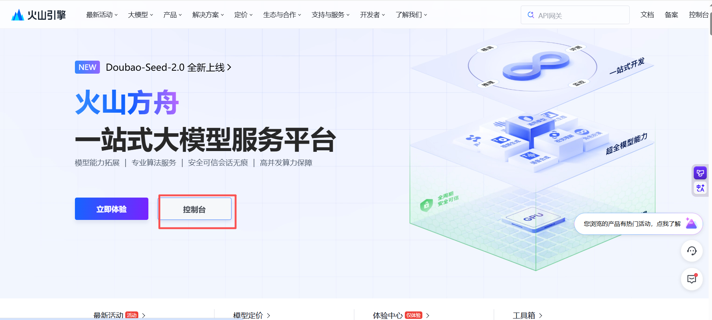
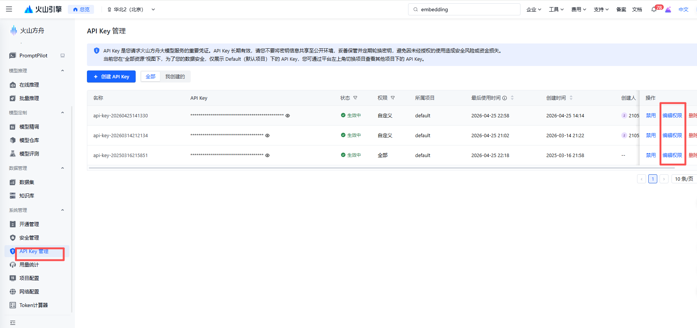
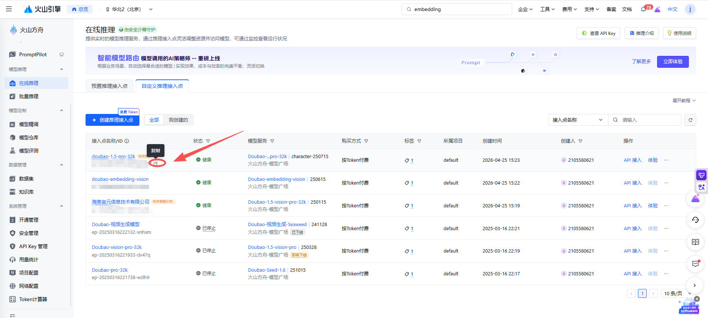
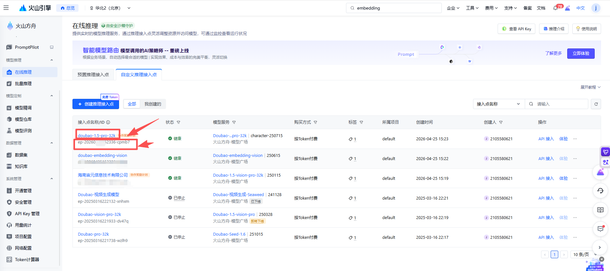
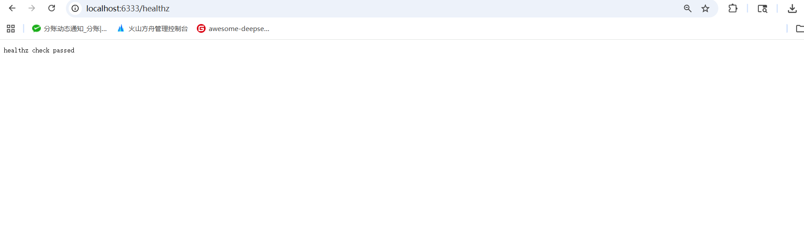
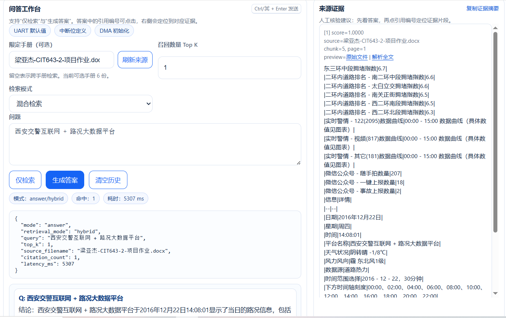

# 截图目录

请将 README 中提到的截图放在本目录，建议使用同名文件，便于团队按 SOP 对照。

## 当前截图预览

### 01-enter-ark-console

### 02-create-api-key

### 04-create-endpoint-vision

### 07-env-mapping

### 08-health-check

### 09-rag-ui-success

